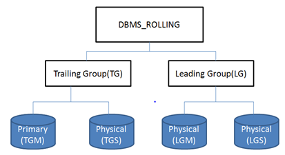

### Synopsis
When I was a DBA, database upgrade is always a big maintenance task which takes most of the downtime even for the mission critical system. In most of common configurations such as RAC with Data Guard, the downtime for the VLDB is still quite significant. 

Most of the companies are still facing following challenges in terms of database upgrade: 
* Downtime: Traditional methods of upgrading a database typically involve taking the database offline for the duration of the upgrade, which can result in significant downtime and inconvenience for users. Even with the physical standby database, database upgrade has to happen at the primary database, during the upgrade time, the database can't be accessed for transaction processing at either primary database or physical standby databases. 
* Concurrent Access: As the database remains online during upgrade and users can still access the database, it is necessary to ensure that the upgrade process does not interfere with the normal operation of the database. 
* Complex Upgrades: Upgrading a large and complex database can be difficult, time-consuming, and risky. 

The best possible solution to use Data Guard to minimize the downtime impact is Transient Rolling Upgrade using Logical Standby. Since the logical standby is in open READ WRITE mode it is independent of production ugprade unlike physical standby database. The Transient Rolling Upgrade feature allows the rolling upgrade of a database. This means that the upgrade process can be performed while the database remains online and accessible to users, rather than requiring the database to be taken offline for the duration of the upgrade.

### DBMS_ROLLING overview 
Starting from Oracle 12c, Oracle has developed DBMS_ROLLING package to implement Rolling Upgrade Using Active Data Guard feature, which streamlines the process of upgrading Oracle Database software in a Data Guard configuration in a rolling fashion. To note that, DBMS_ROLLING with Active Data Guard requires Active Data Guard License. 

DBMS_ROLLING has three main phases, Primary database and standby database are divided into trailing and leading group. Target Primary is called as trailing Group Master (TGM), Target Standby is called as Leading group Master (LGM) and rest of the standby database can either be in trailing or Leading Group depends on their upgrade schedule i.e. in a configuration with multiple standby databases only one standby must be LGM to protect LGM configure Physical standby database. Leading Group must be upgraded first. Database on a trialing group must be started in new home and like TGM other standby databases in trailing group also flash backed to guarantee restore point (GRP). Databases in leading group upgraded first.

- Upgrade Prerequisites
- Upgrade Steps with DBMS_ROLLING
    * Planning a Rolling Upgrade (DBMS_ROLLING.INIT_PLAN)
    * Build the Upgrade Plan (DBMS_ROLLING.BUILD_PLAN)
    * Start Plan (DBMS_ROLLING.START_PLAN)
    * Upgrade Leading Group
    * Switchover (DBMS_ROLLING.SWITCHOVER)
    * Upgrade Trailing Group
    * Finish the Upgrade Plan (DBMS_ROLLING.FINISH_PLAN)
- Post Upgrade Steps

### MOS reference: 
- [Mike Dietrich blog on Rolling Upgrade](https://mikedietrichde.com/2018/05/09/transient-logical-standby-rolling-upgrades-overview/)
- Rolling upgrade using DBMS_ROLLING - Complete Reference (Doc ID 2086512.1)
- [DBMS_ROLLING Reference Guide](https://docs.oracle.com/en/database/oracle/oracle-database/19/arpls/DBMS_ROLLING.html#GUID-097F1B39-E623-43B5-BA30-DF377BFE05CF)
- Transient Rolling Upgrade Using DBMS_ROLLING - Beginners Guide
- Rolling upgrade using DBMS_ROLLING - Complete Reference (Doc ID 2086512.1)
- MAA Whitepaper: SQL Apply Best Practices (Doc ID 1672310.1)
- Step by Step How to Do Swithcover/Failover on Logical Standby Environment (Doc ID 2535950.1)
- How To Skip A Complete Schema From Application on Logical Standby Database (Doc ID 741325.1)
- How to monitor the progress of the logical standby (Doc ID 1296954.1)
- How To Reduce The Performance Impact Of LogMiner Usage On A Production Database (Doc ID 1629300.1)
- Handling ORA-1403 ora-12801 on logical standby apply (Doc ID 1178284.1)
- Troubleshooting Example - Rolling Upgrade using DBMS_ROLLING (Doc ID 2535940.1)
- DBMS Rolling Upgrade Switchover Fails with ORA-45427: Logical Standby Redo Apply Process Was Not Running (Doc ID 2696017.1)
- SRDC - Collect Logical Standby Database Information (Doc ID 1910065.1)
- MRP fails with ORA-19906 after Flashback of Transient Logical Standby used for Rolling Upgrade (Doc ID 2069325.1)
- What Causes High Redo When Supplemental Logging is Enabled (Doc ID 1349037.1)
- Bugs
    - BUG 22541208 - REPLICATION FAILS WITH ORA-02149 DROPING PARTITION WITH SYSTEM GENERATED NAME (fixed in 12.2 backport available for 12.1)
    - BUG 31412209 - TRANSIENT LOGICAL STANDBY UPGRADE FAILING WITH ORA-600[KRVXSAU_122_12202_LCR_OP] (fixed in 12.2 backport available for lower versions)