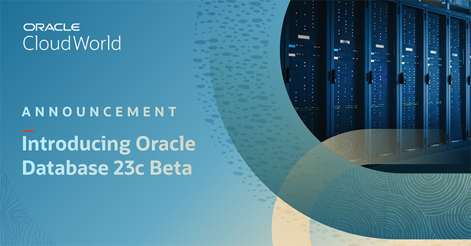

## Oracle 23c Beta Release

Oracle announced 23c Beta Program on Oct, 2022 at Oracle Cloud World. 

Oracle Database 23c beta is the latest release of Oracle's leading converged database. It introduces a range of new and enhanced functionality to assist developers, analysts and DBA's in building and deploying their next generation mission-critical, high-performance operational and analytical applications. Innovative new features include JSON Relational Duality, Real-time SQL Plan Management, True Cache, real-time property graph analysis of operational data, and native replication of database shards. Oracle Database 23 beta release will shortly be available (on-premises and in the Cloud) globally for Oracle customers and partners who complete the beta program recruitment sign-up process.

## Join Beta Program
You can join the Beta Program by submitting your [recruitment form](https://pdpm.oracle.com/pls/apex/f?p=108:158:13239380852000:::::) for review by the Oracle Beta Programs team. You can get first hand experience of latest technologies and features from Oracle Converged Database. 

## Additional Information and Features Preview
[23c Press Release](https://www.oracle.com/news/announcement/ocw-database-innovations-simplify-development-enhance-protection-2022-10-18/)

